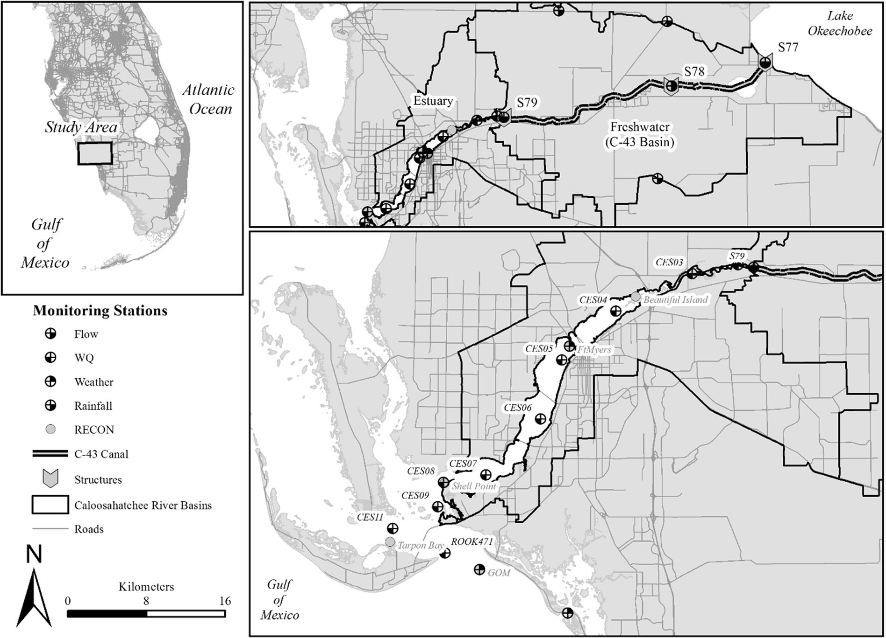
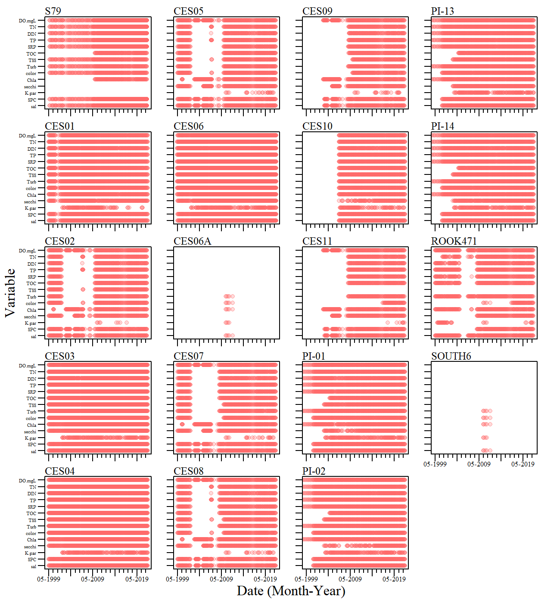
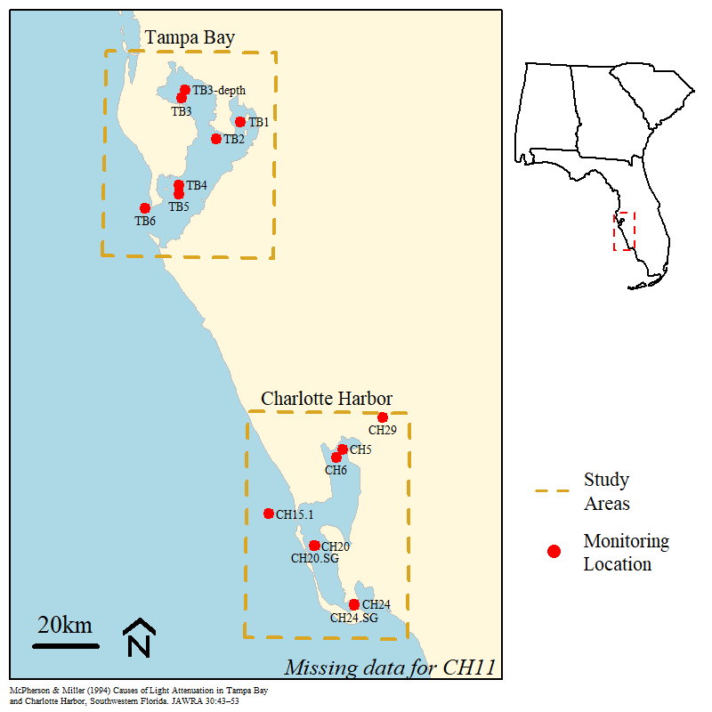

Caloosahatchee River Estuary - Optical Model Evaluation
================

## Table of Contents

-   [Purpose](#purp)
-   [Study Area](#area)
-   [Data Inventory](#inv)
-   [Data](#data)
-   [Literature](#lit)
    -   [McPherson and Miller (1994)](#McPherson)

------------------------------------------------------------------------

### Purpose <a name="purp"></a>

The objective of this project is to evaluate existing optical or
spectral models developed for the tidal Caloosahatchee River Estuary and
surrounding areas. Optical models are useful in Colored dissolved
organic matter (CDOM) dominated estuaries to evaluate changes in light
attenuation and potential impacts to benthic ecology.

### Study Area <a name="area"></a>

The Caloosahatchee River and its estuary is located on the lower west
coast of Florida, USA (Fig 1). The historic Caloosahatchee River was
originally shallow, meandering river with its headwaters located
approximately 100 km inland at Lake Hicpochee and tidally influences
approximately 70 km upstream. To accommodate navigation, flood control
and land reclamation needs the river was straightened and extended
eastward and connected to Lake Okeechobee in the late 1800s essentially
converting the river to a canal, resulting in the C-43 canal
designation. In the early 1900s three lock-and-dam structures were
constructed to control flow and stage elevation along the river. Of the
three lock-and-dam structures installed, the final downstream structure
identified as the S-79 (Franklin Lock and Dam) regulates discharge from
the canal to the estuary. The estuary portion of the Caloosahatchee
River (hereafter Caloosahatchee River Estuary or CRE) extends
approximately 48 km from the S-79 to San Carlos Bay, where it empties
into the Gulf of Mexico and Pine Island Sound

<div class="figure" style="text-align: center">


<p class="caption">
The C-43 and Caloosahatchee River Estuary (CRE) with water quality;
River, Estuary, and Coastal Observing Network (RECON); and flow,
weather, and rainfall monitoring locations identified. Upper left inset
identifies study location relative to the rest of peninsula Florida,
USA. Upper right inset identifies the C-43 canal, C-43 basin, and
estuary relative to Lake Okeechobee and associated water control
structures. Source: Julian and Osborne (2018)
</p>

</div>

### Data Inventory <a name="inv"></a>

<div class="figure" style="text-align: center">


<p class="caption">
Data inventory of selected variables from monitoring location across the
estuary between Lee county environmental monitoring and SFWMD monitoring
programs
</p>

</div>

### Data <a name="data"></a>

Data from South Florida Water Management District SFWMD and Lee County
were collated into a final dataset. The final dataset will have optical,
physical and nutrient parameters for monitoring locations within the
Caloosahatchee River Estuary.

-   *SFWMD:*
    -   Fatally Qualified data were removed.
    -   Only samples taken within the first 2 meters were considered.
    -   If more than one sample was collected in a given day, average
        values were computed (including samples within the 2-meter water
        depth).
-   *Lee County:*
    -   Surface water samples only
    -   Fatally qualified data were removed.
    -   Field duplicate samples (QA/QC) were removed.

### Literature <a name="lit"></a>

Some literature with general summaries specific to this project.

-   Chen Z, Doering PH, Ashton M, Orlando BA (2015) Mixing Behavior of
    Colored Dissolved Organic Matter and Its Potential Ecological
    Implication in the Caloosahatchee River Estuary, Florida. Estuaries
    and Coasts 38:1706–1718. <https://doi.org/10.1007/s12237-014-9916-0>

    -   CDOM is one of the most important water quality constituents
        impacting light attenuation in estuaries; its concentration and
        distribution influence light quality and quantity available to
        phytoplankton and submerged aquatic vegetation.

    -   Light attenuation in the CRE was controlled primarily by CDOM in
        the upper estuary and by turbidity in the lower estuary. The
        contribution of chlorophyll a (Chl a) to light attenuation was
        less than both CDOM and turbidity.

-   Corbett CA, Hale JA (2006) Development of water quality target for
    Charlotte Harbor, Florida using seagrass light requirements. Florida
    Scientist 69:36–50
    [Link](https://www.jstor.org/stable/24322131?seq=1#metadata_info_tab_contents)

    -   Provides an optical model to set water quality targets for
        color, turbidity and chlorophyll a that maintain
        percent-light-at-depth requirements to achieve the maximum
        seagrass depth distribution presently observed in seagrass
        transect monitoring. Analysis of recently collected water
        quality data show that in all regions of the harbor, dry season
        water quality in general met the percent-light-at-depth goals
        proposed in this effort but less than half the data met the
        goals during the wet season

-   Dixon LK, Wessel MR (2016) A spectral optical model and updated
    water clarity reporting tool for Charlotte Harbor seagrasses.
    Florida Scientist 79:69–92.
    [Link](https://www.jstor.org/stable/44113166)

    -   Quantify how primary light attenuation parameters affect the
        amount and quality of light reaching seagrass target depths
        through the development of a spectrally explicit optical model,
        based on partitioned absorption and scattering, and
        parameterized as a function of color, chlorophyll, and
        turbidity.

-   McPherson BF, Miller RL (1987) The vertical attenuation of light in
    Charlotte Harbor, a shallow, subtropical estuary, south-western
    Florida. Estuarine, Coastal and Shelf Science 25:721–737.
    <https://doi.org/10.1016/0272-7714(87)90018-7>

    -   The relative contribution of different components to the
        attenuation of PAR as determined in the Charlotte Harbor
        estuarine system based on laboratory and *in-situ* measurements.

    -   Suspended Solids, DOM (color), chlorophyll and water accounted
        for as much as 99% of k<sub>t</sub>

-   McPherson B, Miller R (1994) Causes of Light Attenuation in Tampa
    Bay and Charlotte Harbor, Southwestern Florida. Journal of The
    American Water Resources Association - J AM WATER RESOUR ASSOC
    30:43–53.

-   Choice ZD, Frazer TK, Jacoby CA (2014) Light requirements of
    seagrasses determined from historical records of light attenuation
    along the Gulf coast of peninsular Florida. Marine Pollution
    Bulletin 81:94–102.
    [10.1016/j.marpolbul.2014.02.015](https://www.sciencedirect.com/science/article/pii/S0025326X14001118?casa_token=47OlgPYT0mcAAAAA:AEACtmuKK8KTIplDAJDvBR8XWIEyU8MWnF-FdZ9gOqtGJ7fG53kOiWWrwZl_yGUhF5jK9KAK4Gw)

    -   light requirements were determined for four common and abundant
        seagrasses along the Gulf coast of peninsular Florida using a
        threshold detecting algorithm. Light requirements ranged from 8%
        to 10% of surface irradiance for *Halophila engelmannii* to
        25–27% of surface irradiance for *Halodule wrightii*.

    -   Study performed across a color (DOM) gardient from high
        (Steinhatchee, Suwannee and Waccasassa) to relatively clear
        water systems along the Springs Coast (Big Bend from Weeki
        Wachee to Steinhatchee).

------------------------------------------------------------------------

#### McPherson and Miller (1994) <a name="McPherson"></a>

Data was retrieved from USGS NWIS to recreate the optical model
presented by McPherson and Miller. All sites (and presumbly) data used
in the original publication was retrieved from USGS NWIS except for site
CH11 (in Charlotte Harbor).

<div class="figure" style="text-align: center">


<p class="caption">
Map of monitoring locations used by McPherson and Miller (1987),
reproduced using available data in USGS NWIS.
</p>

</div>

``` r
library(AnalystHelper)
library(reshape2)
library(dataRetrieval)
USGS.CH.sites=data.frame(siteID=c("264408082204800","263840082120500",
                                  "263840082114800","265355082075500",
                                  "262839082041200","262829082041200",
                                  "265522082064600","270055081590300"),
                         siteName=c("CH15.1","CH20",
                                    "CH20.SG","CH6",
                                    "CH24","CH24.SG",
                                    "CH5","CH29"))
USGS.TB.sites=data.frame(siteID=c("274837082314600","275701082375599",
                                  "275530082383300","274033082385300",
                                  "273900082385300","273631082452600",
                                  "275134082270599"),
                         siteName=c("TB2","TB3-depth","TB3",
                                    "TB4","TB5","TB6","TB1"))
usgs.sites=rbind(USGS.CH.sites,USGS.TB.sites)
usgs.sites$MonitoringLocationIdentifier=paste0("USGS-",usgs.sites$siteID)

NWIS.siteinfo=readNWISsite(usgs.sites$siteID)

## Retrieve Data for NWIS (except CH11)
dates=date.fun(c("1989-10-01","1991-10-31"))
dat=readWQPdata(siteNumbers=usgs.sites$MonitoringLocationIdentifier,
                startDate=dates[1],endDate=dates[2])

pCode=c("00080","00076","70953","70957","70971")
param.xwalk=data.frame(parm_cd=pCode,
                       param=c("Color","Turb","Chla","Chla","Kpar"))
dat=readNWISqw(siteNumbers=usgs.sites$siteID,
                startDate=dates[1],endDate=dates[2],parameterCd=pCode)

dat=merge(dat,param.xwalk,"parm_cd")
dat=merge(dat,usgs.sites,by.x="site_no",by.y="siteID")
dat$sample_dt=date.fun(dat$sample_dt)
dat.xtab=dcast(dat,siteName+sample_dt~param,value.var="result_va",mean)

# Kpar model 
kpar.mod=lm(Kpar~Color+Turb+Chla,dat.xtab)
summary(kpar.mod)
```

    ## 
    ## Call:
    ## lm(formula = Kpar ~ Color + Turb + Chla, data = dat.xtab)
    ## 
    ## Residuals:
    ##      Min       1Q   Median       3Q      Max 
    ## -0.72788 -0.13678 -0.03602  0.11608  1.76657 
    ## 
    ## Coefficients:
    ##             Estimate Std. Error t value Pr(>|t|)    
    ## (Intercept) 0.331103   0.040154   8.246 9.99e-14 ***
    ## Color       0.015077   0.000645  23.376  < 2e-16 ***
    ## Turb        0.069904   0.012140   5.758 5.05e-08 ***
    ## Chla        0.059425   0.008751   6.791 2.82e-10 ***
    ## ---
    ## Signif. codes:  0 '***' 0.001 '**' 0.01 '*' 0.05 '.' 0.1 ' ' 1
    ## 
    ## Residual standard error: 0.2647 on 142 degrees of freedom
    ##   (78 observations deleted due to missingness)
    ## Multiple R-squared:   0.83,  Adjusted R-squared:  0.8265 
    ## F-statistic: 231.2 on 3 and 142 DF,  p-value: < 2.2e-16

``` r
gvlma::gvlma(kpar.mod)
```

    ## 
    ## Call:
    ## lm(formula = Kpar ~ Color + Turb + Chla, data = dat.xtab)
    ## 
    ## Coefficients:
    ## (Intercept)        Color         Turb         Chla  
    ##     0.33110      0.01508      0.06990      0.05942  
    ## 
    ## 
    ## ASSESSMENT OF THE LINEAR MODEL ASSUMPTIONS
    ## USING THE GLOBAL TEST ON 4 DEGREES-OF-FREEDOM:
    ## Level of Significance =  0.05 
    ## 
    ## Call:
    ##  gvlma::gvlma(x = kpar.mod) 
    ## 
    ##                       Value  p-value                   Decision
    ## Global Stat        1472.927 0.000000 Assumptions NOT satisfied!
    ## Skewness            135.868 0.000000 Assumptions NOT satisfied!
    ## Kurtosis           1325.855 0.000000 Assumptions NOT satisfied!
    ## Link Function         6.687 0.009713 Assumptions NOT satisfied!
    ## Heteroscedasticity    4.517 0.033562 Assumptions NOT satisfied!

``` r
layout(matrix(1:4,2,2))
plot(kpar.mod)
```


**Model cited in McPherson and Miller (1994)**


**Model recreated with available data**


------------------------------------------------------------------------
